# 🚀 Enterprise AI Assistant

## 🧠 From Data Chaos → Intelligent Decisions

---

## 🌐 Live Demo

🔗 **Try the system now:**  
https://enterprise-ai-assistant-sur4kq7x5earjxpxfgabcj.streamlit.app/

📂 **GitHub Repository:**  
https://github.com/alaashorbaji96-hue/enterprise-ai-assistant

---

## 🎬 The Story

Imagine this...

A company has:

- 📄 Thousands of PDF reports  
- 📊 Raw data scattered across systems  
- 📉 No clear insights  
- ⏳ Analysts spending hours just trying to understand  

Every day:

- Decisions are delayed  
- Opportunities are missed  
- Data exists… but value does not  

---

## ⚠️ The Real Problem

The issue is not lack of data.

👉 The problem is:

> **Data without understanding = No decision power**

Traditional tools fail because they:

- Show dashboards but don’t explain them  
- Require experts to interpret results  
- Separate documents from data  
- Don’t connect insights to decisions  

---

## 💡 The Shift

What if the system could:

- Read documents like a human  
- Understand data like an analyst  
- Explain insights like an expert  
- And guide decisions like a consultant  

---

## 🚀 Introducing Enterprise AI Assistant

This system is designed to:

> 📄 Understand documents  
> 📊 Analyze data  
> 🧠 Generate insights  
> 💼 Support decisions  

All in **one unified AI platform**

---

## 🔥 Core Transformation
📄 Documents + 📊 Raw Data
↓
🧠 AI Understanding
↓
💡 Insights Generation
↓
🚀 Business Decisions

---

## 🧠 What Makes It Different?

This is not:

❌ A dashboard  
❌ A chatbot  
❌ A data tool  

---

👉 This is:

> 🧠 **An Intelligent Decision System**

---

## 🏠 First Look

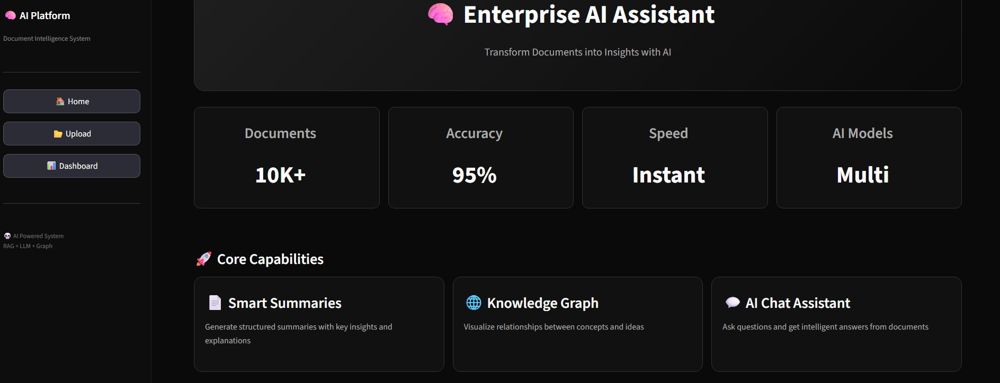

---

## 🎯 Value for Businesses

- Reduce analysis time from hours → seconds  
- Turn raw data into real insights  
- Enable non-technical decision makers  
- Unify documents + analytics in one system  

---

## 🧩 What’s Coming Next?

In the next sections, you’ll see:

1️⃣ How the system understands documents  
2️⃣ How it analyzes data automatically  
3️⃣ How it generates insights  
4️⃣ How everything is powered by multi-agent AI  

---

👉 Let’s start the journey...
# 🔄 Section 2 — The User Journey (From Upload → Insight)

---

## 🎬 The Experience Begins

The user opens the platform.

No complexity. No setup.

Just one simple action:

> 📄 Upload your document

---

## 🏠 Step 1 — Entry Point

At this moment, the system is waiting.

No configuration.  
No technical steps.  

👉 Just interaction.

---

## 📤 Step 2 — Upload & Activation

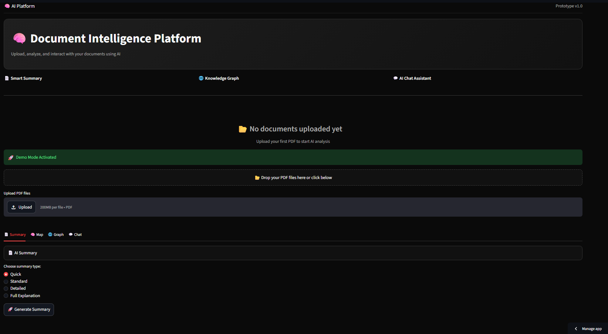

The user uploads a document.

And something important happens instantly:

> ⚡ The AI system activates automatically

---

## 🧠 What Happens Behind the Scenes?

While the user sees a simple interface…

The system is already:

- Parsing the document  
- Chunking the content  
- Embedding semantic meaning  
- Preparing for retrieval (RAG)  

👉 All in real-time

---

## 📄 Step 3 — Smart AI Summarization

The system doesn't just summarize…

It **understands**.

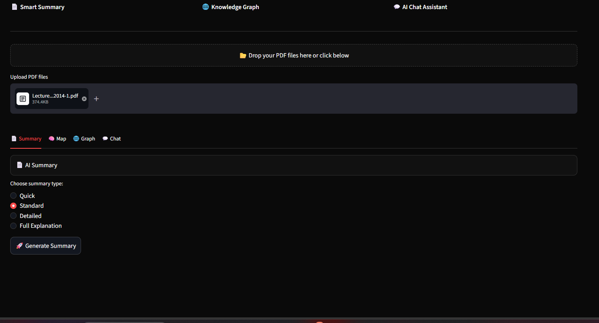
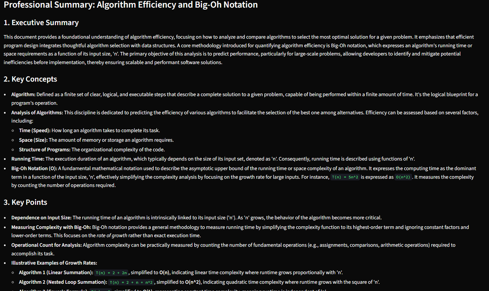
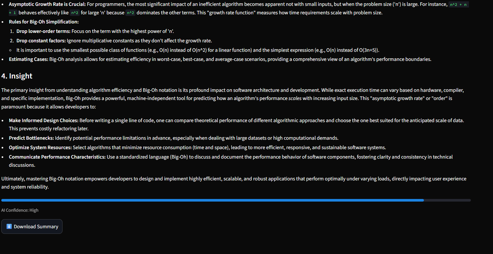
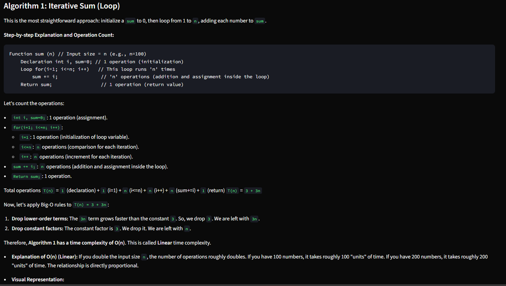

---

### 💡 What the User Gets:

- Executive Summary  
- Key Concepts  
- Technical Breakdown  
- Logical Explanation  

---

## 🧠 The Difference

Traditional tools:
- Extract text  

This system:
- Extracts **meaning**

---

## 🗺️ Step 4 — Document Structure Understanding

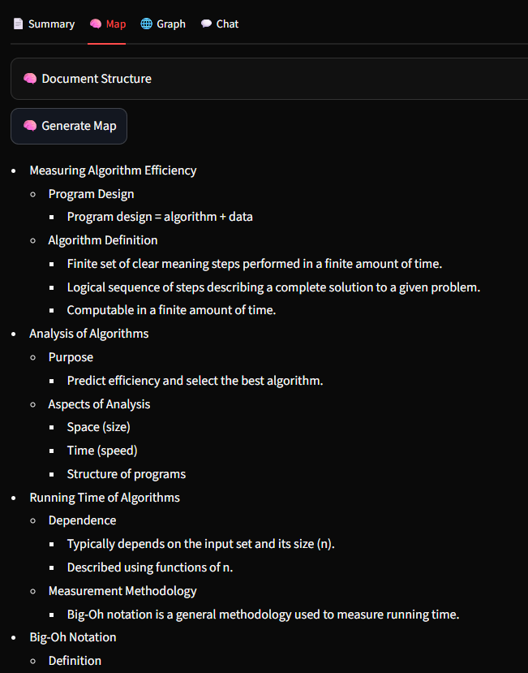

Now the system goes deeper.

It builds:

- Hierarchical structure  
- Topic segmentation  
- Logical relationships  

👉 The document becomes **structured knowledge**

---

## 🔗 Step 5 — Knowledge Graph Generation

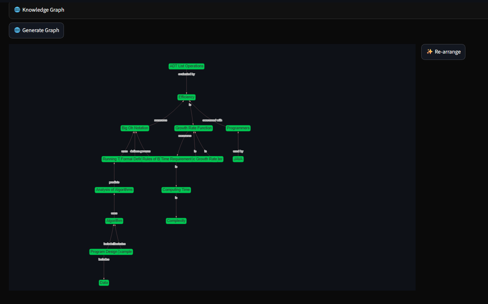

Instead of reading line by line…

The system creates:

- Concept nodes  
- Relationship edges  
- Connected understanding  

👉 This is **visual reasoning**

---

## 💬 Step 6 — AI Chat Interaction

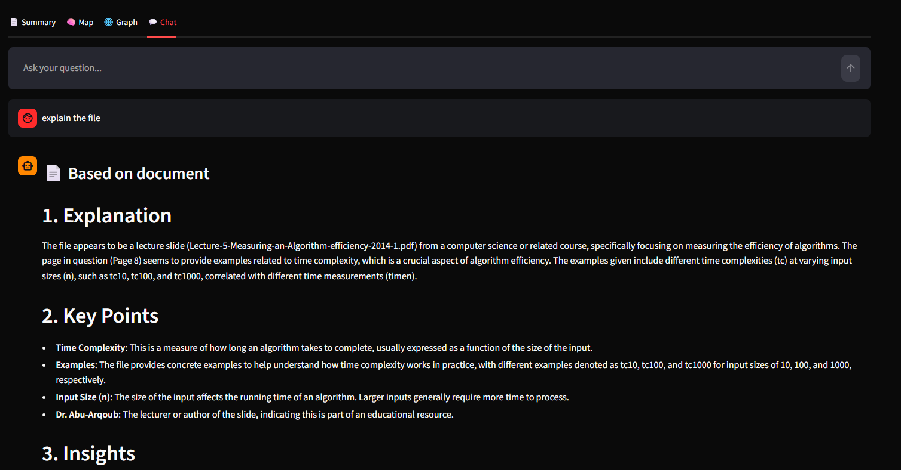
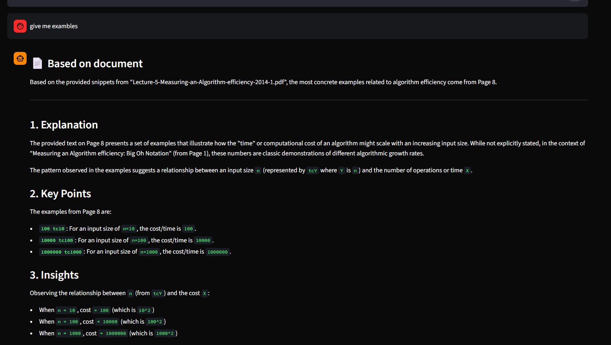

Now the user can interact.

Ask anything.

---

### 🧪 Example Queries:

- "Explain the document"  
- "Give examples"  
- "What is the algorithm complexity?"  

---

### 🤖 System Response:

- Context-aware  
- Structured  
- Deep reasoning  
- Not generic  

---

## ⚡ What Just Happened?

In just a few steps:

✔ Document → Understood  
✔ Knowledge → Structured  
✔ Questions → Answered  

---

## 🚀 The Key Insight

The user didn’t:

- Read the full document  
- Analyze manually  
- Write any code  

---

👉 The system did everything.

---

## 🧠 Why This Matters

This is where the transformation starts:

> From **reading documents**  
➡️ To **interacting with knowledge**

---

## 🔜 What’s Next?

Now that the system understands documents…

👉 It’s time to understand **data**

➡️ Next Section: **AI Analytics Dashboard**
# 📊 Section 3 — AI Analytics Dashboard (From Data → Understanding)

---

## 🎬 The Next Step in the Journey

After understanding documents…

The system moves to something even more critical:

> 📊 Understanding data

---

## ⚠️ The Reality of Data Today

Most companies already have data.

But:

- ❌ They don’t understand it  
- ❌ They rely on static dashboards  
- ❌ They need experts to interpret results  
- ❌ Insights are slow and manual  

---

👉 The result?

> Data exists… but decisions are still weak

---

## 💡 The Shift

Instead of dashboards…

What if the system could:

- Analyze data automatically  
- Detect patterns instantly  
- Explain results clearly  
- Guide decisions intelligently  

---

## 🚀 Enter the AI Analytics Dashboard

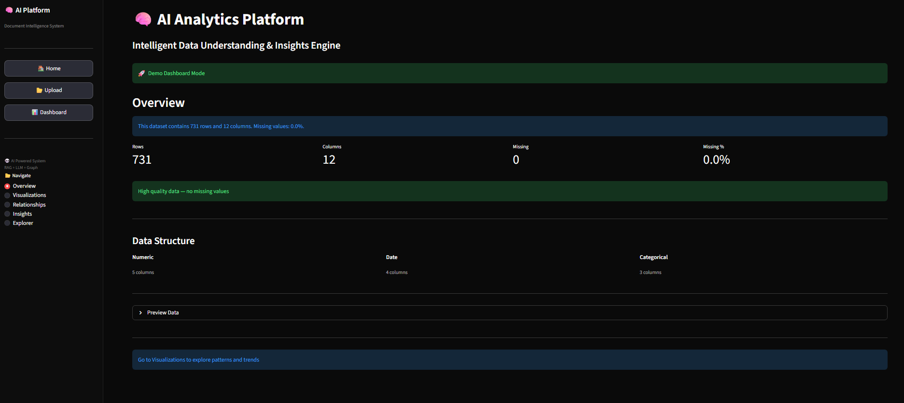
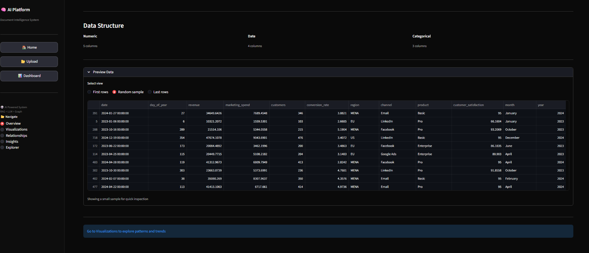

---

## 🔍 Step 1 — Instant Data Understanding

The moment data is loaded:

The system automatically detects:

- Number of rows  
- Number of columns  
- Missing values  
- Data quality  

---

### 💡 Example:

👉 731 rows  
👉 12 columns  
👉 0% missing values  

---

## 🧠 What This Means

No manual inspection.  
No pandas `.info()`  
No preprocessing guesswork  

---

👉 The system **understands your dataset instantly**

---

## 📦 Step 2 — Data Structure Intelligence

The system classifies features automatically:

- 🔢 Numerical features  
- 📅 Date features  
- 🏷️ Categorical features  

---

## 💡 Why This Matters

Normally:

- Analysts spend time identifying column types  
- Mistakes lead to wrong analysis  

---

👉 Here:

The system does it correctly — automatically

---

## 🧪 Step 3 — Data Preview Engine

The user can instantly:

- View first rows  
- Sample random data  
- Explore dataset structure  

---

## ⚡ What Just Happened?

Without writing a single line of code:

✔ Data loaded  
✔ Structure identified  
✔ Quality validated  
✔ Ready for analysis  

---

## 🧠 Behind the Scenes

The system is already preparing:

- Data typing  
- Statistical profiling  
- Feature categorization  
- Ready-to-analyze format  

---

## 🚀 The Key Transformation

Traditional workflow:
Load Data → Clean → Explore → Analyze → Understand

---

This system:

Load Data → Understand Immediately

---

## 💼 Business Impact

- Reduce analysis time from hours → seconds  
- Eliminate manual data inspection  
- Enable faster decision cycles  
- Make data accessible to non-experts  

---

## 🔥 What Makes This Powerful?

This is not:

❌ A static dashboard  
❌ A visualization tool  

---

👉 This is:

> 🧠 **An Intelligent Data Understanding Engine**

---

## 🔜 What’s Next?

Now the system understands the data…

👉 It’s time to **see patterns visually**

➡️ Next Section: **Advanced Data Visualization Engine**
# 📈 Section 4 — Advanced Visualization Engine (Seeing What Data Hides)

---

## 🎬 The Turning Point

The system now understands the data.

But understanding alone is not enough.

> 👀 Humans need to *see* patterns to trust them

---

## ⚠️ The Problem with Traditional Visualization

Most tools:

- Show charts without explanation  
- Require manual configuration  
- Don’t guide interpretation  
- Separate visuals from insights  

---

👉 Result:

> Users see graphs… but don’t understand them

---

## 💡 The Shift

What if visualization was:

- Automatic  
- Intelligent  
- Context-aware  
- Connected to insights  

---

## 🚀 Visualization Engine in Action

---

## 🔹 Step 1 — Distribution & Statistical Understanding

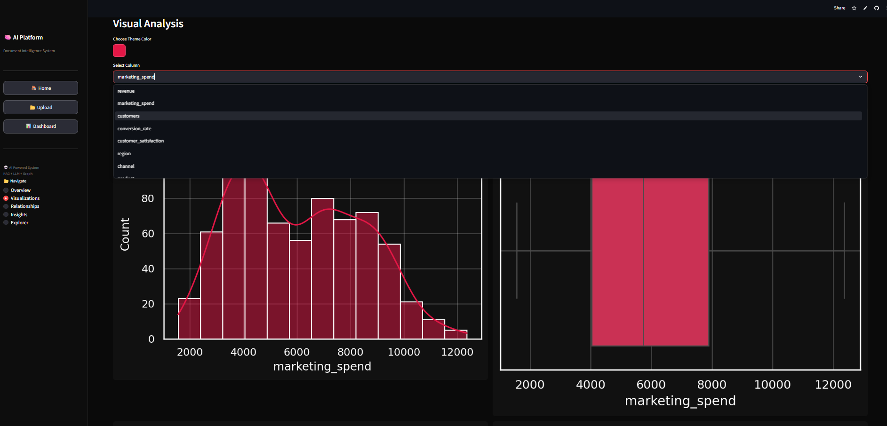
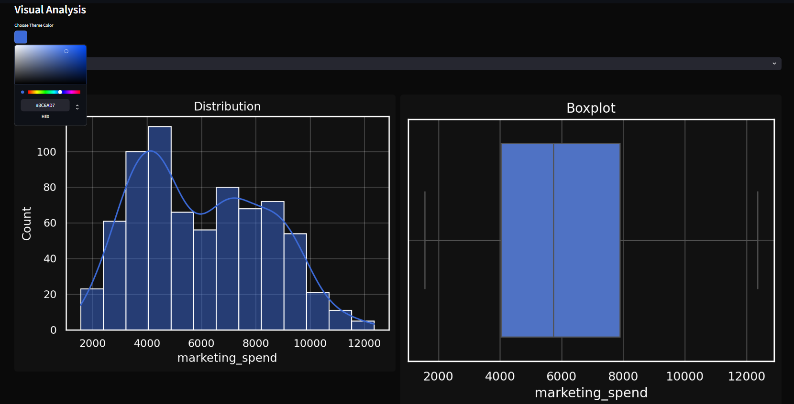

---

### 🧠 What the System Detects:

- Data distribution shape  
- Skewness  
- Outliers  
- Density patterns  

---

### 💡 Why This Matters:

- Identify abnormal behavior  
- Understand variability  
- Detect hidden issues  

---

## 🔹 Step 2 — Trend Analysis (Time-Based Insights)

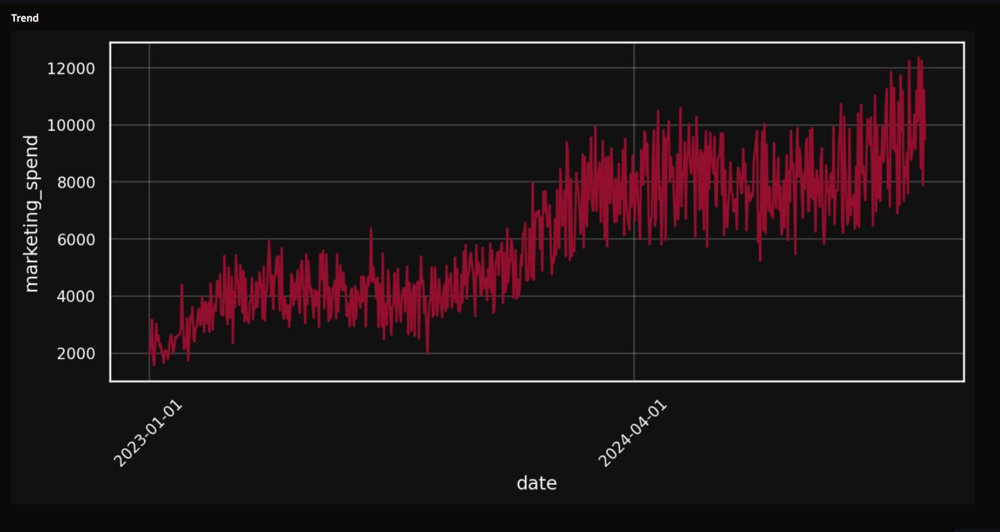

---

### 📊 What You See:

- Growth patterns  
- Seasonality  
- Fluctuations  
- Sudden anomalies  

---

### 🧠 Example Insight:

👉 Revenue increasing over time  
👉 Possible seasonal spikes  
👉 Sudden drops = anomalies  

---

## 🔹 Step 3 — Relationship Visualization

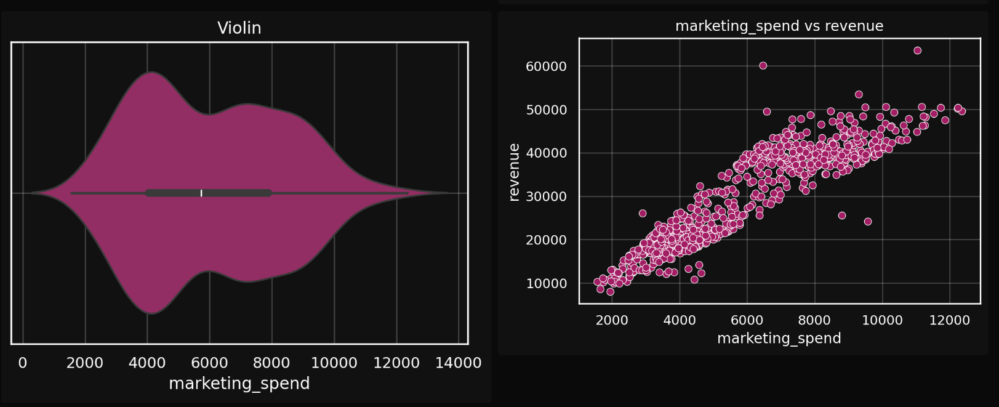

---

### 🔗 What the System Reveals:

- Correlations between variables  
- Linear / non-linear patterns  
- Clusters of behavior  

---

### 💡 Example:

👉 marketing_spend ↑ → customers ↑ → revenue ↑  

---

## 🧠 What Makes This Different?

Traditional visualization:

❌ Static  
❌ Manual  
❌ Isolated  

---

This system:

✔ Dynamic  
✔ Automated  
✔ Insight-driven  

---

## ⚡ What Just Happened?

Without user effort:

✔ Distributions analyzed  
✔ Trends detected  
✔ Relationships visualized  

---

👉 The system turned raw numbers into **visual intelligence**

---

## 💼 Business Value

- Detect risks early  
- Understand performance trends  
- Identify growth drivers  
- Support strategic planning  

---

## 🔥 The Real Power

This is not just about charts.

> It’s about turning **visual patterns → business meaning**

---

## 🔜 What’s Next?

Now that we can see the data…

👉 Let’s explore it interactively

➡️ Next Section: **Interactive Data Explorer**
# 🔎 Section 5 — Interactive Data Explorer (From Seeing → Exploring)

---

## 🎬 The Next Evolution

The system has:

✔ Understood the data  
✔ Visualized patterns  

Now comes the most powerful step:

> 🧠 Let the user explore intelligently

---

## ⚠️ The Limitation of Traditional Tools

In most tools:

- Exploration requires coding  
- Filtering is limited  
- Analysis is static  
- Users depend on analysts  

---

👉 Result:

> Only experts can truly explore the data

---

## 💡 The Shift

What if exploration was:

- Interactive  
- Dynamic  
- AI-assisted  
- Accessible to everyone  

---

## 🚀 Interactive Explorer in Action

---

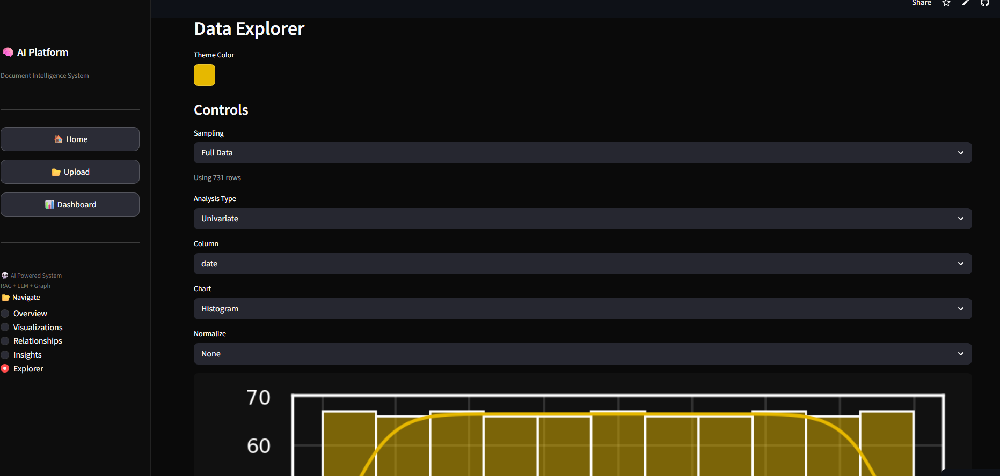
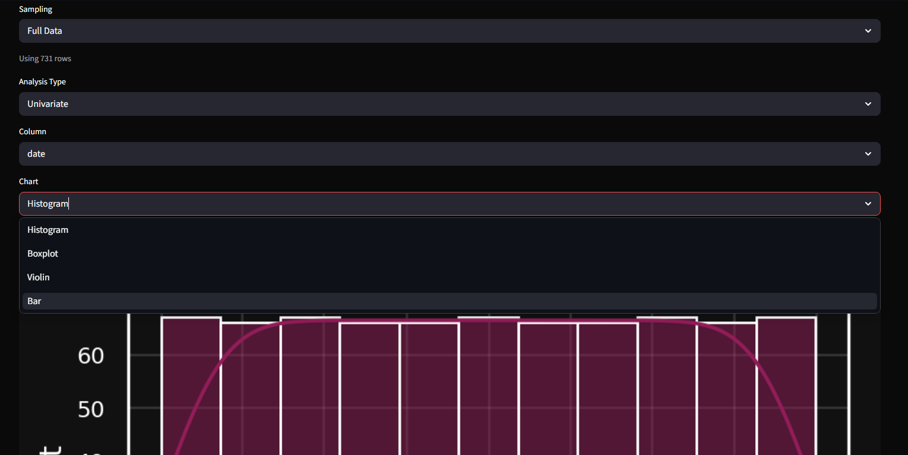
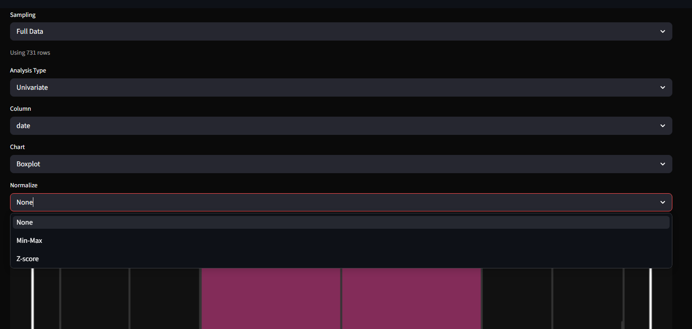
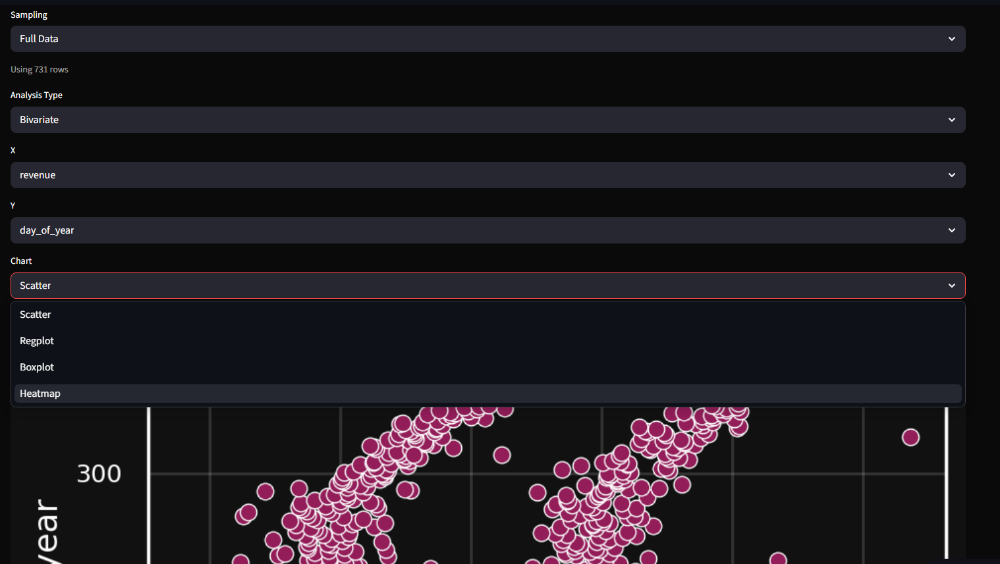
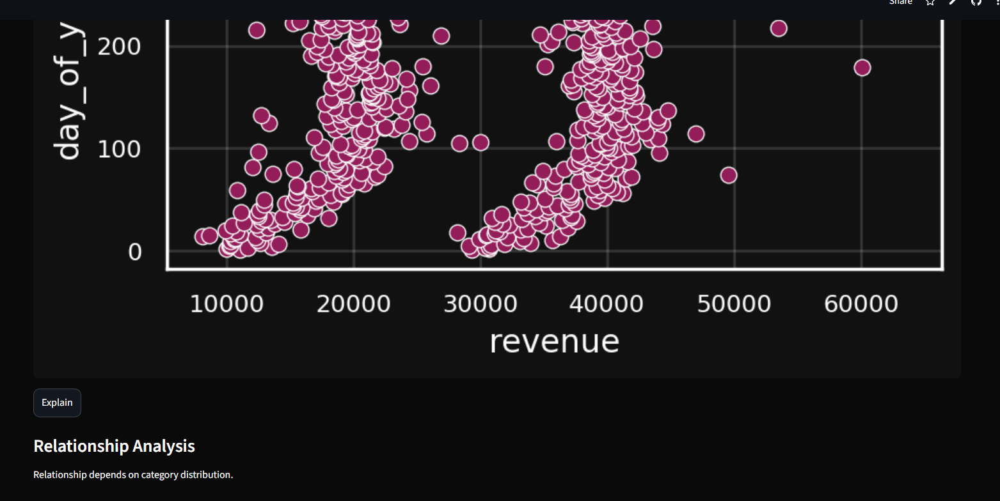

---

## 🧠 What the User Can Do

### 🔹 Univariate Analysis

Analyze a single variable:

- Distribution  
- Outliers  
- Spread  

---

### 🔹 Bivariate Analysis

Understand relationships:

- Correlation  
- Scatter patterns  
- Dependencies  

---

### 🔹 Multivariate Analysis

Explore complex interactions:

- Multiple features  
- Combined impact  
- Hidden patterns  

---

## 📊 Supported Visualizations

- Histogram  
- Boxplot  
- Violin Plot  
- Scatter Plot  
- Pairplot  

---

## ⚡ Real-Time Interaction

The system responds instantly:

- Change variable → chart updates  
- Apply filter → insights update  
- Switch analysis → visualization adapts  

---

## 🧠 Behind the Scenes

While the user interacts:

- Data is reprocessed dynamically  
- Visualizations are regenerated  
- Context is preserved  
- No performance drop  

---

## 💼 Business Value

- Empower non-technical users  
- Enable fast hypothesis testing  
- Discover hidden insights  
- Reduce dependency on data teams  

---

## 🔥 What Makes This Powerful?

This is not:

❌ A static dashboard  
❌ A limited filter tool  

---

👉 This is:

> 🧠 **An Interactive AI-Powered Exploration System**

---

## ⚡ What Just Happened?

The user didn’t:

- Write code  
- Request reports  
- Wait for analysis  

---

👉 The system turned exploration into an **instant experience**

---

## 🔜 What’s Next?

We explored the data…

Now it's time to understand:

👉 **Why things happen**

➡️ Next Section: **Relationships & Correlation Engine**
# 🔗 Section 6 — Relationships Engine (From Data → Cause & Effect)

---

## 🎬 The Critical Question

At this stage, the system has:

✔ Understood the data  
✔ Visualized patterns  
✔ Enabled exploration  

But one question still remains:

> ❓ Why is this happening?

---

## ⚠️ The Problem

Most tools show:

- Charts  
- Numbers  
- Trends  

But they fail to explain:

- What drives growth?  
- What impacts revenue?  
- Which variables actually matter?  

---

👉 Result:

> Users see patterns… but don’t understand causes

---

## 💡 The Shift

Instead of just showing relationships…

What if the system could:

- Detect correlations automatically  
- Measure relationship strength  
- Highlight key drivers  
- Guide interpretation  

---

## 🚀 Correlation Engine in Action

---

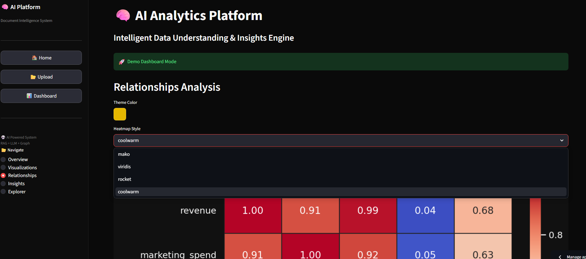
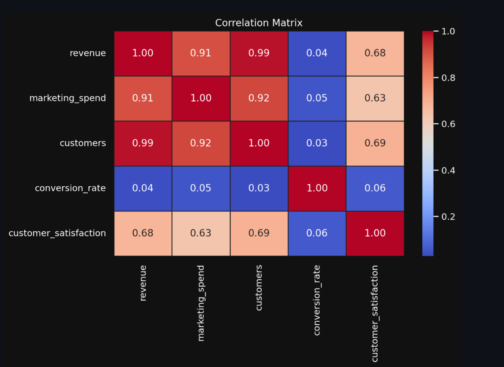
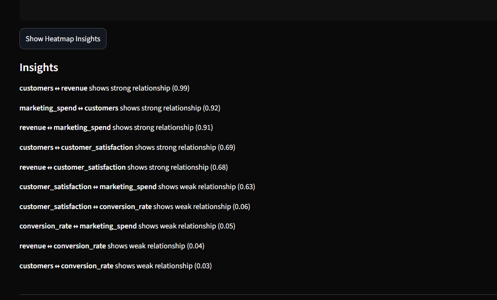
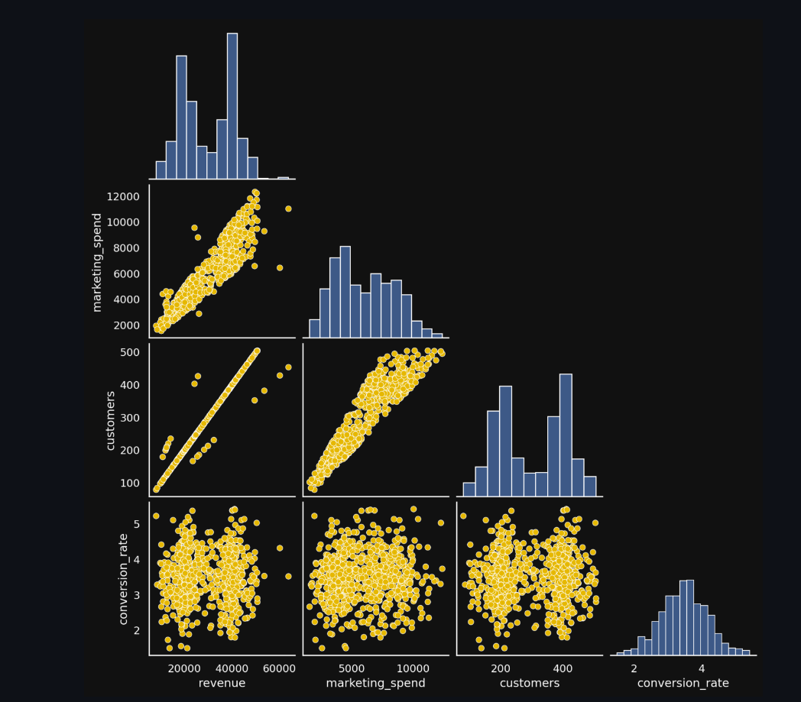
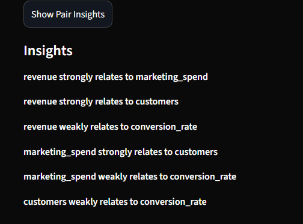

---

## 🧠 What the System Detects

- Strong correlations  
- Weak relationships  
- Hidden dependencies  
- Feature interactions  

---

## 📊 Key Insights Automatically Extracted

### ✅ Strong Relationships

- revenue ↔ customers (**0.99**)  
- marketing_spend ↔ customers (**0.92**)  
- revenue ↔ marketing_spend (**0.91**)  

---

### ⚠️ Weak Relationships

- conversion_rate ↔ revenue  
- conversion_rate ↔ customers  
- conversion_rate ↔ marketing_spend  

---

## 💡 Interpretation (What This Means)

👉 Revenue is primarily driven by:

- Customer acquisition  
- Marketing investment  

👉 Conversion rate:

- Has limited direct impact  
- May indicate inefficiency in funnel  

---

## 🧠 Why This Matters

Without this system:

- Analysts manually compute correlations  
- Interpretation depends on experience  
- Insights are slow and subjective  

---

With this system:

✔ Relationships detected instantly  
✔ Strength quantified  
✔ Insights generated automatically  

---

## ⚡ What Just Happened?

The system transformed:

📊 Raw data  
→ 🔗 Relationships  
→ 🧠 Understanding  
→ 💡 Insights  

---

## 💼 Business Value

- Identify key revenue drivers  
- Optimize marketing strategies  
- Detect inefficiencies  
- Support strategic decisions  

---

## 🔥 What Makes This Unique?

Traditional tools:

❌ Show correlation matrices  
❌ Require interpretation  

---

This system:

✔ Detects patterns  
✔ Explains them  
✔ Translates them into decisions  

---

## 🔜 What’s Next?

Now we understand relationships…

👉 It’s time for the most powerful step:

➡️ Turning insights into **AI-generated intelligence**

Next Section: **AI Insights Engine**
# 🧠 Section 7 — AI Insights Engine (From Analysis → Intelligence)

---

## 🎬 The Final Transformation

Until now, the system has:

✔ Understood documents  
✔ Analyzed data  
✔ Visualized patterns  
✔ Detected relationships  

---

But here is the real leap:

> 🧠 The system starts thinking

---

## ⚠️ The Limitation of Traditional Analytics

Even after analysis:

- Someone still needs to interpret results  
- Insights depend on human expertise  
- Reports take time  
- Decisions are delayed  

---

👉 The gap:

> 📊 Analysis exists  
> ❌ Intelligence does not

---

## 💡 The Shift

What if the system could:

- Interpret results automatically  
- Generate insights like an expert  
- Explain findings clearly  
- Translate data into decisions  

---

## 🚀 AI Insights Engine in Action

---

### 📌 Insights Dashboard

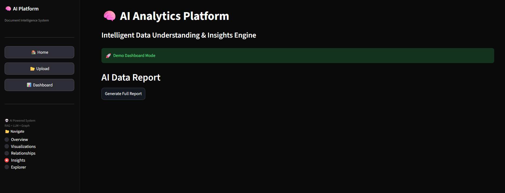
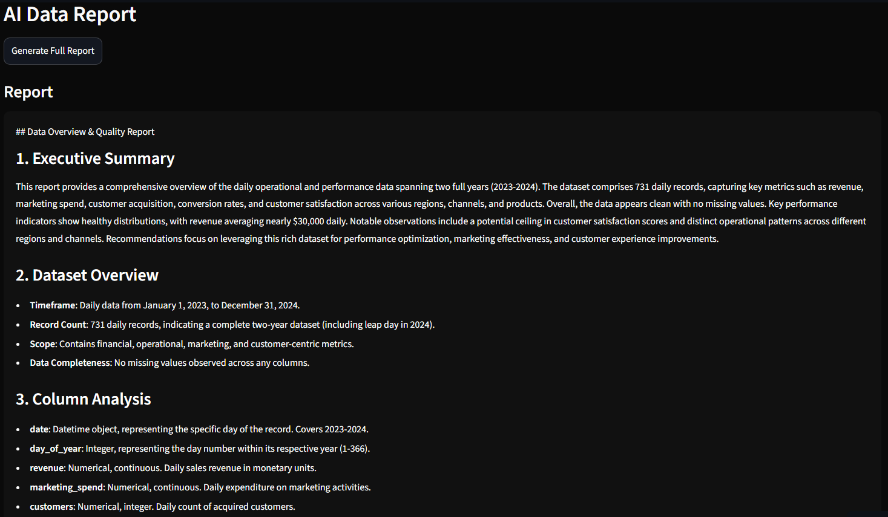
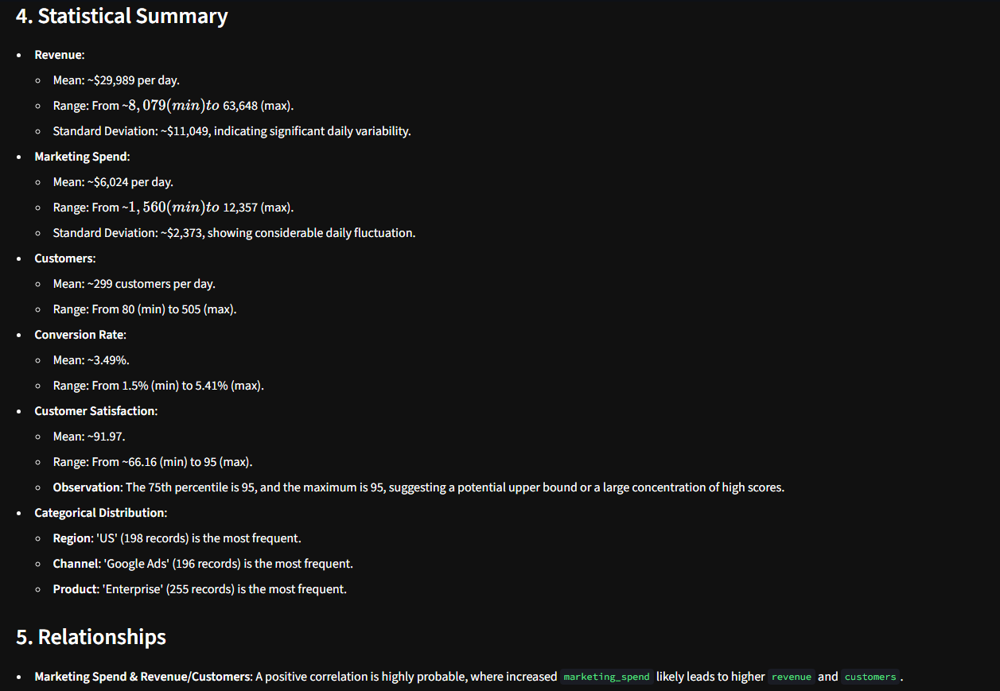
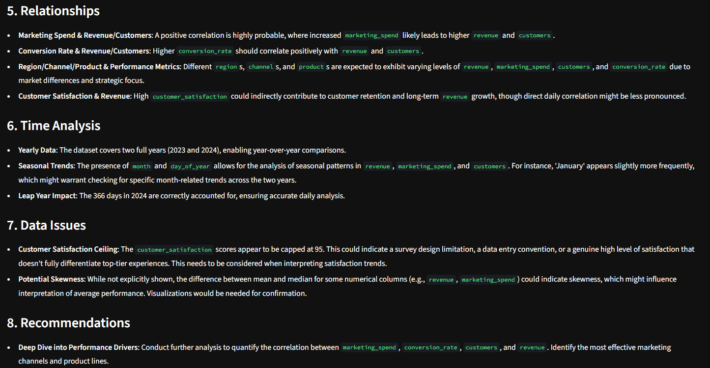
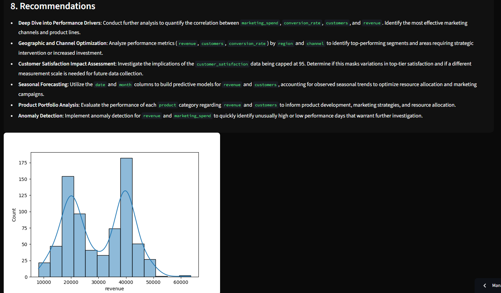
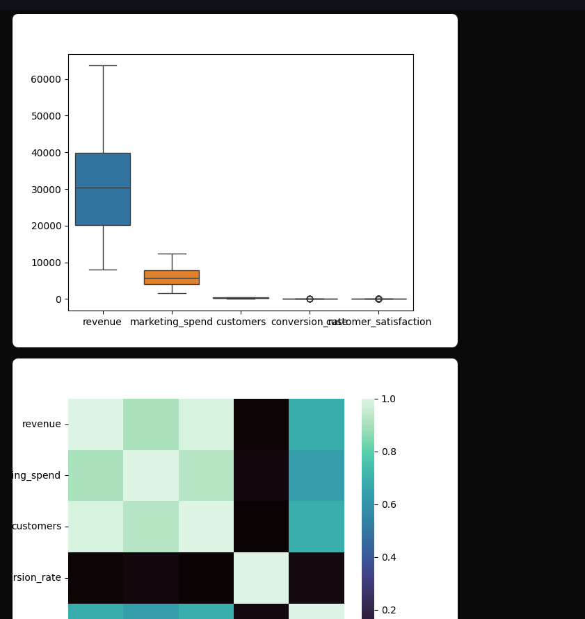
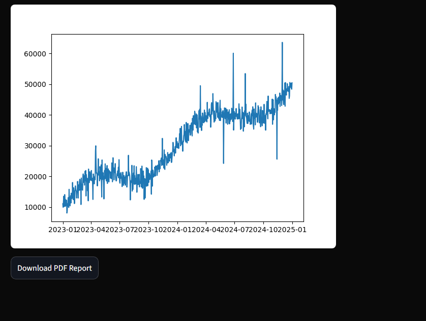

---

## 🧠 What the System Does

Automatically:

- Detects patterns  
- Identifies key drivers  
- Explains relationships  
- Highlights anomalies  
- Generates human-readable insights  

---

## 📊 Example Insight (Generated by AI)

👉 “Revenue growth is strongly driven by customer acquisition,  
with marketing spend acting as a key influencing factor.”

---

## 💡 What This Means

The system:

- Connects multiple variables  
- Understands cause-effect relationships  
- Translates data into business language  

---

## 🧠 Behind the Scenes

The Insights Engine combines:

- Statistical analysis  
- Correlation detection  
- Context understanding  
- LLM-based reasoning  

---

## ⚡ What Just Happened?

The system transformed:

📊 Data + 🔗 Relationships  
→ 🧠 Understanding  
→ 💡 Insights  
→ 🚀 Decisions  

---

## 💼 Business Impact

- Faster decision-making  
- Reduced dependency on analysts  
- Clear explanations for stakeholders  
- Immediate actionable insights  

---

## 🔥 Why This Is Powerful

This is not:

❌ A dashboard  
❌ A reporting tool  
❌ A visualization system  

---

👉 This is:

> 🧠 **An AI Reasoning Engine**

---

## 🧩 The Big Difference

Traditional systems:

📊 Show data  

---

This system:

🧠 Understands → Explains → Guides  

---

## 🚀 The Outcome

The user doesn’t need to:

- Analyze manually  
- Interpret charts  
- Write reports  

---

👉 The system does it all

---

## 🔜 What’s Next?

Now we have intelligence…

👉 Let’s understand **how the system is built**

➡️ Next Section: **Multi-Agent Architecture**
# 🤖 Section 8 — Multi-Agent Architecture (How the System Thinks)

---

## 🎬 Behind the Intelligence

Everything you've seen so far:

- Document understanding  
- Data analysis  
- Visualization  
- Insights generation  

---

👉 Is not random.

It is powered by a **structured Multi-Agent AI System**

---

## 🧠 The Core Idea

Instead of one monolithic model…

The system is designed as:

> 🧩 Multiple specialized AI agents working together

---

## ⚙️ High-Level Architecture
User Input
↓
AI Orchestrator
↓
Document Agent | Retrieval Agent | Data Agent | Insight Agent
↓
Unified AI Output

---

## 🧠 Why Multi-Agent?

Because real intelligence requires:

- Separation of responsibilities  
- Specialized processing  
- Coordinated reasoning  

---

👉 Just like a real team

---

## 🧩 Agent Breakdown

---

### 📄 Document Agent

**Role:**

- Parse uploaded documents  
- Chunk text  
- Prepare semantic units  

---

### 🔍 Retrieval Agent

**Role:**

- Generate embeddings  
- Perform similarity search  
- Retrieve relevant context  

---

### 🧠 LLM Agent

**Role:**

- Generate responses  
- Explain concepts  
- Perform reasoning  

---

### 📊 Data Agent

**Role:**

- Analyze datasets  
- Perform EDA  
- Generate statistics & visuals  

---

### 💡 Insight Agent

**Role:**

- Interpret results  
- Generate insights  
- Translate data → business meaning  

---

## 🔄 How Agents Work Together

1. User uploads document or data  
2. Document/Data Agent processes input  
3. Retrieval Agent finds relevant context  
4. LLM Agent generates understanding  
5. Insight Agent produces explanations  

---

👉 Output:

> 🧠 Unified, intelligent response

---

## ⚡ Key Design Advantages

### ✔ Modularity

Each component is independent  
→ Easy to scale & improve  

---

### ✔ Scalability

New agents can be added:

- Forecasting Agent  
- Recommendation Agent  
- XAI Agent  

---

### ✔ Maintainability

- Clear separation of logic  
- Easy debugging  
- Flexible architecture  

---

### ✔ Performance

- Parallel processing  
- Optimized workflows  
- Efficient reasoning  

---

## 🧠 Behind the Scenes Technologies

- LLMs (for reasoning & generation)  
- RAG (for contextual understanding)  
- FAISS (for vector search)  
- Pandas / NumPy (data processing)  
- Plotly / Seaborn (visualization)  

---

## 💡 Why This Matters

Most projects:

❌ Use one model  
❌ Mix everything together  

---

This system:

✔ Structured  
✔ Scalable  
✔ Production-ready  

---

## 🚀 Engineering Value

This architecture demonstrates:

- System design skills  
- AI integration  
- Real-world scalability thinking  

---

## 🔜 What’s Next?

Now you’ve seen how the system works internally…

👉 Let’s look at the **technology stack powering it**

➡️ Next Section: **Tech Stack & Engineering**
# ⚙️ Section 9 — Tech Stack & Engineering (Built for Real-World Use)

---

## 🎬 From Idea → System

Behind every intelligent system…

There is a set of engineering decisions.

Not just *what* technologies are used…  
But *why* they are used.

---

## 🧠 Design Philosophy

The system is built on 3 core principles:

- ✔ Simplicity in interaction  
- ✔ Power in processing  
- ✔ Scalability in design  

---

## ⚙️ Full Technology Stack

| Layer | Technology | Purpose |
|------|----------|--------|
| 🖥️ Frontend | Streamlit | Fast interactive UI |
| ⚙️ Backend | FastAPI | Scalable API layer |
| 🧠 AI Core | LLM + RAG | Reasoning & understanding |
| 📊 Data Processing | Pandas, NumPy | Data manipulation |
| 📈 Visualization | Plotly, Seaborn | Interactive charts |
| 🔗 Vector DB | FAISS | Semantic search |

---

## 🧠 Why These Choices?

---

### 🔹 Streamlit (Frontend)

- Rapid development  
- Clean UI  
- Interactive components  

👉 Ideal for AI-driven dashboards

---

### 🔹 FastAPI (Backend)

- High performance  
- Async support  
- Easy API integration  

👉 Suitable for scalable systems

---

### 🔹 LLM + RAG (Core Intelligence)

- Context-aware responses  
- Document understanding  
- Reduced hallucination  

👉 Enables real AI reasoning

---

### 🔹 FAISS (Vector Database)

- Fast similarity search  
- Efficient embeddings retrieval  

👉 Core for RAG pipelines

---

### 🔹 Pandas & NumPy (Data Engine)

- Efficient processing  
- Flexible transformations  

👉 Backbone of analytics engine

---

### 🔹 Plotly & Seaborn (Visualization)

- Interactive plots  
- Statistical visualizations  

👉 Supports deep data exploration

---

## 🔄 System Workflow (Engineering View)
User Input
↓
Frontend (Streamlit UI)
↓
Backend (FastAPI)
↓
AI Processing Layer
↓
Agents + RAG + Data Engine
↓
Visualization + Insights
↓
User Output

---

## ⚡ Performance Considerations

The system is designed to:

- Handle real-time interaction  
- Process data efficiently  
- Minimize latency in responses  

---

## 🧠 Scalability Potential

This architecture supports future expansion:

- Cloud deployment (AWS / GCP)  
- API-based integrations  
- Multi-user support  
- Real-time data pipelines  

---

## 🔐 Production Readiness

The system is structured to be:

- Modular  
- Extendable  
- Maintainable  

---

👉 Ready to evolve into a full enterprise product

---

## 💼 Engineering Value

This project demonstrates:

- Full-stack AI system design  
- Integration of multiple AI paradigms  
- Practical implementation (not just theory)  

---

## 🚀 What Makes This Strong?

This is not:

❌ A notebook  
❌ A demo script  

---

👉 This is:

> ⚙️ **A deployable AI system architecture**

---

## 🔜 What’s Next?

Now that you’ve seen:

✔ The problem  
✔ The solution  
✔ The system  
✔ The architecture  

---

👉 Let’s conclude with the **real impact**

➡️ Final Section: **Business Value & Conclusion**
# 🚀 Section 10 — Business Impact & Final Conclusion

---

## 🎬 The Big Picture

What started as:

📄 Documents  
📊 Raw Data  

---

Has become:

🧠 Understanding  
💡 Insights  
🚀 Decisions  

---

## 🧠 What This System Achieves

This platform is not just a tool…

It is a **complete decision-support system** that:

- Understands documents  
- Analyzes data automatically  
- Detects patterns  
- Generates insights  
- Explains results  

---

👉 All in one unified experience

---

## 💼 Real Business Impact

### ⏱️ Speed

- Reduce analysis time from **hours → seconds**  

---

### 🎯 Accuracy

- Eliminate manual interpretation errors  
- Provide consistent AI-driven insights  

---

### 🧠 Accessibility

- Enable non-technical users  
- Remove dependency on data experts  

---

### 📈 Decision Quality

- Identify key drivers  
- Detect risks early  
- Support strategic planning  

---

## 🔥 Competitive Advantage

Compared to traditional tools:

| Traditional Systems | This System |
|-------------------|------------|
| Static dashboards | Dynamic AI reasoning |
| Manual analysis | Automated insights |
| Requires experts | Accessible to all |
| Data only | Data + intelligence |

---

## 🧠 The Key Innovation

The real innovation is not:

- RAG  
- Dashboards  
- Visualization  

---

👉 It is:

> 🔥 **Combining everything into one intelligent system**

---

## 🧩 What Makes This Project Unique

- End-to-end AI pipeline  
- Multi-agent architecture  
- Integration of NLP + Data Science  
- Explainable AI outputs  
- Real-world applicability  

---

## 🚀 Future Extensions

The system is designed to grow:

- 📡 Real-time data streaming  
- ☁️ Cloud deployment (AWS / GCP)  
- 🧠 Explainable AI (XAI) modules  
- 🤖 Autonomous AI agents  
- 📊 Predictive analytics  

---

## 👨‍💻 About the Author

**Alaa Shorbaji**  
AI Engineer | Data Scientist  

- Specialized in AI systems & deep learning  
- Focused on building real-world intelligent solutions  
- Experienced in NLP, Data Science, and AI architectures  

---

## ⭐ Final Statement

This is not just a project.

This is:

> 🚀 A step toward building **intelligent systems that think, analyze, and guide decisions**

---

## 🎯 Closing Thought

In a world full of data…

The real advantage is not having more data.

---

👉 It is:

> 🧠 **Understanding it better**

---
